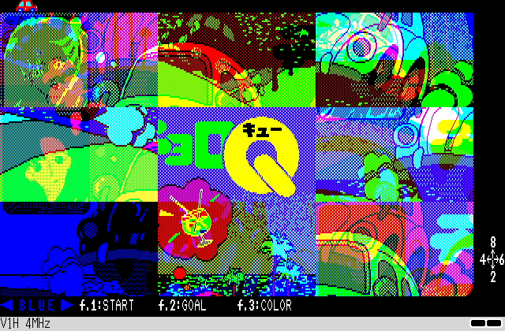

# Choro Q Holiday Puzzle

## Game Site

https://retroachievements.org/game/14928

## Overview

Choro Q Holiday Puzzle is a sliding puzzle game where the gimmick is that you have to independently solve three sliding puzzles mapping to the blue, red, and green channels of the final image. Clear four difficulty levels, each dividing the same image into more tiles, and _reveal_ more of a tiny picture of an anime woman each time.



## Set Design

### Achievements

#### Progression and Win Condition

Clearing each difficulty's puzzle is a Progression achievement, so a game clear requires clearing all four of them.

#### Per Puzzle

Each puzzle has two achievements:
- Beat the puzzle
- Beat the puzzle within a certain amount of time.
    - For reference, I was able to beat the Beginner puzzle in 80 seconds, and the Junior puzzle in 500 seconds total. I've extrapolated the times for the other two difficulties based on how many moves they should take compared to Junior (usually double and triple respectively).

#### Miscellaneous

There is one extra achievement for beating the puzzle on Junior or above (i.e. not the Beginner 3x3 puzzle) with only switching to each color when necessary.

### Leaderboards

Each puzzle size has a single time to clear leaderboard.

### Rich Presence

When in a puzzle, the rich presence shows:
```
Sliding on Beginner difficulty - Correct Tiles: Blue #.#/.../##., Red #.#/.../##., Green #.#/.../##.
```

The `#` and `.` characters represent correct and incorrectly positioned tiles when looking left-to-right and top-to-bottom in the puzzle.

All the other handled states are:
```
Choosing a difficulty level
```
```
Observing the puzzle on Beginner difficulty
```
```
Admiring a solved puzzle on Beginner difficulty
```
```
Deciding to try again
```

And a generic state:
```
Sliding the Choro Q Holiday Puzzle
```