# Vasteel

## Game Site

https://retroachievements.org/game/12888

## Overview

Vasteel is a 1990 strategy video game for the PC Engine CD. It was released in Japan on December 20th, 1990, and localised to the US on April 21st, 1993. It was never released in PAL regions. After the assassination of the Vasteel Solar System's emperor, Rodriguez Faracia, the eldest of his two sons, Faliall, becomes the new emperor. Desiring change, the younger son, Stefan, leads a revolt against Faliall and the two battle for complete dominance of the Vasteel system. Play as either brother in their respective campaigns across 31 maps, or play any map in the VS mode with 1, 2, or even 0 players. Move and purchase units on a hexagonal grid in typical strategy game fashion, and then actively control a mech in an 8-direction shooter mode when capturing buildings or destroying enemy units. Capture the opponent's base to win each level.

## Set Design

### Game Flow Description

Since it's not documented anywhere else, this is the flow for the scenario mode.

```mermaid
flowchart TD
    subgraph Faliall
        FaliallNohma[Nohma]

        FaliallKengolaBranch1A[Kengola]
        FaliallGalandiaBranch1B[Galandia]

        FaliallNohma --> FaliallKengolaBranch1A
        FaliallNohma --> FaliallGalandiaBranch1B

        FaliallGalandiaBranch1A[Galandia]
        FaliallKengolaBranch1B[Kengola]

        FaliallKengolaBranch1A --> FaliallGalandiaBranch1A
        FaliallGalandiaBranch1B --> FaliallKengolaBranch1B

        FaliallNickeeyuSBranch2A[Nickeeyu S]
        FaliallElgualaSBranch2B[Elguala S]

        FaliallGalandiaBranch1A --> FaliallNickeeyuSBranch2A
        FaliallKengolaBranch1B --> FaliallNickeeyuSBranch2A
        FaliallGalandiaBranch1A --> FaliallElgualaSBranch2B
        FaliallKengolaBranch1B --> FaliallElgualaSBranch2B

        FaliallNickeeyu1Branch2A[Nickeeyu 1]
        FaliallElguala1Branch2B[Elguala 1]

        FaliallNickeeyuSBranch2A --> FaliallNickeeyu1Branch2A
        FaliallElgualaSBranch2B --> FaliallElguala1Branch2B

        FaliallNickeeyu2Branch2A[Nickeeyu 2]
        FaliallElguala2Branch2B[Elguala 2]

        FaliallNickeeyu1Branch2A --> FaliallNickeeyu2Branch2A
        FaliallElguala1Branch2B --> FaliallElguala2Branch2B

        FaliallElgualaSBranch2A[Elguala S]
        FaliallNickeeyuSBranch2B[Nickeeyu S]

        FaliallNickeeyu2Branch2A --> FaliallElgualaSBranch2A
        FaliallElguala2Branch2B --> FaliallNickeeyuSBranch2B

        FaliallElguala1Branch2A[Elguala 1]
        FaliallNickeeyu1Branch2B[Nickeeyu 1]

        FaliallElgualaSBranch2A --> FaliallElguala1Branch2A
        FaliallNickeeyuSBranch2B --> FaliallNickeeyu1Branch2B

        FaliallElguala2Branch2A[Elguala 2]
        FaliallNickeeyu2Branch2B[Nickeeyu 2]

        FaliallElguala1Branch2A --> FaliallElguala2Branch2A
        FaliallNickeeyu1Branch2B --> FaliallNickeeyu2Branch2B

        FaliallLaysarkS[Laysark S]

        FaliallElguala2Branch2A --> FaliallLaysarkS
        FaliallNickeeyu2Branch2B --> FaliallLaysarkS

        FaliallLaysark1[Laysark 1]

        FaliallLaysarkS --> FaliallLaysark1

        FaliallLaysark2[Laysark 2]

        FaliallLaysark1 --> FaliallLaysark2

        FaliallJaroaS[Jaroa S]

        FaliallLaysark2 --> FaliallJaroaS

        FaliallJaroa1[Jaroa 1]

        FaliallJaroaS --> FaliallJaroa1

        FaliallJaroa2[Jaroa 2]

        FaliallJaroa1 --> FaliallJaroa2

        FaliallJaroa3[Jaroa 3]

        FaliallJaroa2 --> FaliallJaroa3

        FaliallFinalFight[Final Fight]

        FaliallJaroa3 --> FaliallFinalFight

    end

    subgraph Stefan

        StefanNohma[Nohma]

        StefanHumaBranch1A[Huma]
        StefanVersaiBranch1B[Versai]

        StefanNohma --> StefanHumaBranch1A
        StefanNohma --> StefanVersaiBranch1B

        StefanVersaiBranch1A[Versai]
        StefanHumaBranch1B[Huma]

        StefanHumaBranch1A --> StefanVersaiBranch1A
        StefanVersaiBranch1B --> StefanHumaBranch1B

        StefanNobbornSBranch2A[Nobborn S]
        StefanEllitaSBranch2B[Ellita S]

        StefanVersaiBranch1A --> StefanNobbornSBranch2A
        StefanHumaBranch1B --> StefanNobbornSBranch2A
        StefanVersaiBranch1A --> StefanEllitaSBranch2B
        StefanHumaBranch1B --> StefanEllitaSBranch2B

        StefanNobborn1Branch2A[Nobborn 1]
        StefanEllita1Branch2B[Ellita 1]

        StefanNobbornSBranch2A --> StefanNobborn1Branch2A
        StefanEllitaSBranch2B --> StefanEllita1Branch2B

        StefanNobborn2Branch2A[Nobborn 2]
        StefanEllita2Branch2B[Ellita 2]

        StefanNobborn1Branch2A --> StefanNobborn2Branch2A
        StefanEllita1Branch2B --> StefanEllita2Branch2B

        StefanEllitaSBranch2A[Ellita S]
        StefanNobbornSBranch2B[Nobborn S]

        StefanNobborn2Branch2A --> StefanEllitaSBranch2A
        StefanEllita2Branch2B --> StefanNobbornSBranch2B

        StefanEllita1Branch2A[Ellita 1]
        StefanNobborn1Branch2B[Nobborn 1]

        StefanEllitaSBranch2A --> StefanEllita1Branch2A
        StefanNobbornSBranch2B --> StefanNobborn1Branch2B

        StefanEllita2Branch2A[Ellita 2]
        StefanNobborn2Branch2B[Nobborn 2]

        StefanEllita1Branch2A --> StefanEllita2Branch2A
        StefanNobborn1Branch2B --> StefanNobborn2Branch2B

        StefanJinarlS[Jinarl S]

        StefanEllita2Branch2A --> StefanJinarlS
        StefanNobborn2Branch2B --> StefanJinarlS

        StefanJinarl1[Jinarl 1]

        StefanJinarlS --> StefanJinarl1

        StefanJinarl2[Jinarl 2]

        StefanJinarl1 --> StefanJinarl2

        StefanBeloseS[Belose S]

        StefanJinarl2 --> StefanBeloseS

        StefanBelose1[Belose 1]

        StefanBeloseS --> StefanBelose1

        StefanBelose2[Belose 2]

        StefanBelose1 --> StefanBelose2

        StefanBelose3[Belose 3]

        StefanBelose2 --> StefanBelose3

        StefanFinalFight[Final Fight]

        StefanBelose3 --> StefanFinalFight

    end
```



To interpret this, both characters start in the same level Nohma. As you win that character's campaign, you move downwards. As Stefan, you get a choice after Nohma to visit Huma or Versai next, and again after that to visit Nobborn or Ellita first, but you have to play the other levels anyways. Faliall similarly gets two choices like this. Make it to the Final Fight after 16 total maps cleared, and you get into a fight with your brother. For both characters, winning and losing give a different ending scene, totalling with four scenes. You cannot save directly before this fight though, so ideally you should quicksave before capturing the final base in Belose 3 or Jaroa 3.

If the player ever loses a battle (and doesn't want to load a save), they move backwards one level (e.g. failing Belose S as Stefan moves you back to Jinarl 2). This follows whatever branch the player had chosen. Interestingly, failing Nohma **begins** moving downward the other character's branch (e.g. losing as Stefan moves you to Kengola, and winning Kengola moves you back to Nohma). If you continue losing, you'll eventually reach the other campaign's Final Fight, which interestingly gives you the ability to witness the two endings from the other character's campaign without having to win a single map (i.e. losing every battle and winning the final fight as Stefan is the exact same ending as winning every battle and losing the final fight as Faliall). This achievement set asserts that the victory endings are achieved in the correct campaigns though, so you can't just ignore playing the game for these.

### Achievements

#### Per Map

For all 31 maps, there's two achievements, one for winning the battle as each side. These achievements must be completed in **fair fights**, which means that the player cannot start with units if the opponent doesn't, and must have equal or less starting money than the opponent. By default, the VS mode will have units on for both players, and start with 10000G. In the scenario mode, it's 5000G for some reason, but it's **always** a fair fight (even if some maps near the end of the campaign are trickier for one player than the other).

In order to know the player actually started in a fair fight situation though, these maps must be played in a single sitting with no quicksaving (as the game doesn't persist how much starting money the players had). Every map can be chosen freely in VS mode if a scenario is replayed.

While technically every combination is possible in scenario mode, you're most likely going to win 16 maps as each character (unless you intentionally lose 15 maps at the beginning of the campaign for some reason), which leaves 30 achievements that you probably want to go back to VS mode for.

#### Progression

There's actually zero progression achievements, as each campaign will get different per map achievements, and there's nothing really extra that the scenario mode does until the end.

#### Game Completion

There are 4 achievements for each ending of the game. Winning the final fight in either campaign is a win condition (which will mark the game as beaten), but the failure endings are also accounted for. There's a secret achievement for staying in the credits.

#### Miscellaneous

There are four extra achievements that can be earned in any map:
- Start with 10000G and reach 60000G at some point (if you quickload or start with more money, dropping to a lower amount will work).
- Have 32 units.
- Have 30 cities and 5 factories.
- Defeat an opponent's base in one singular go (enter the battle with the base at 255 health and leave with it at 0).

### Leaderboards

There is a leaderboard for each map/character for completing it in the fewest number of turns.

### Rich Presence

The rich presence lists all the primary stats of a game, and starts with an indicator of who you're playing as:

```
Playing as Faliall on Laysark 1 - Turn 5 - Fallial C: 4, F: 2, U: 12, M: 15000, Base: 255/255, Stefan C: 3, F: 1, U: 8, M: 12500, Base: 255/255
Playing as Stefan on Laysark 1 - Turn 5 - Fallial C: 4, F: 2, U: 12, M: 15000, Base: 255/255, Stefan C: 3, F: 1, U: 8, M: 12500, Base: 255/255
```

There's also some additional RPs if you play in 2-player or 0-player:

```
Playing a two-player game on Laysark 1 - Turn 5 - Fallial C: 4, F: 2, U: 12, M: 15000, Base: 255/255, Stefan C: 3, F: 1, U: 8, M: 12500, Base: 255/255
Watching an AI battle on Laysark 1 - Turn 5 - Fallial C: 4, F: 2, U: 12, M: 15000, Base: 255/255, Stefan C: 3, F: 1, U: 8, M: 12500, Base: 255/255
```

If in a menu, the rich presence will just say:

```
Planning the next battle in Vasteel...
```