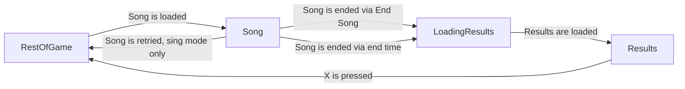

# Singstar

## Game Site

https://retroachievements.org/game/22438

## Overview

TODO

## Set Design

### Game Flow Description



There are four states of the game that most of the achievements operate under:

#### `Song`
This is when the player is currently performing a song. Specifically:
- The microphone is on (this prevents replays from counting).
- There is only one microphone on (prevents 2 players in Sing mode).
- The player is either specifically in Sing mode or Star Maker mode.
- The game has music audio queued up (there's a very particular value used for this).
- Song progress changed from 0 to 1 this frame (helps differentiate between the cutscenes and actual songs).

The values we care about are:
- The current song ID.
- The player difficulty.
- Whether the song is in normal or short mode.
- The player's current total score.
- The player's current note streak score.

The achievements we care about in this stage are:
- Rick Roll as it triggers as early as we can detect the player is in _Never Gonna Give You Up_.
- Hot Got A Dollar as we want to measure whether the player has reached that certain part of the song.
- Streak achievements as they need to not reset now and begin counting increases to the note streak score.
- Leaderboards as they need to show the player's current total score.

#### `LoadingResults`
This is when the player is transitioning from `Song` to `LoadingResults`. It is important to detect this stage as we don't want to invalidate achievements/leaderboards that operate across stages such as:
- Streak achievements
- Leaderboards

There are no specific values we care about in this stage, as this only lasts a few frames and no achievements should trigger here.

#### `Results`
This is when the player is seeing their score after finishing a song. This is used to trigger most achievements as it awards the player outside of active gameplay (removing distractions), and is simpler to handle playlist-based achievements from the career mode.

This can be detected with:
- `score_screen_detector() == 0x3f4ac000`

The values we care about are:
- The current song ID.
- The player difficulty.
- Whether the current song is in normal or short mode.
- The player's current total score.
- The player's total score across other playlist songs.

The achievements we care about in this stage are:
- Career playlist objectives.
- 9000 score achievement.
- Song easy/hard scores achievements.
- Leaderboard submissions.

#### `RestOfGame`
Every other state doesn't need to be specially considered. We can rest any measures from other achievements/leaderboards and for the most part not trigger anything. It is important to be **not** any of the other three stages when it comes to invalidating achievements though.

The exception are the career buzz rank achievements, which trigger after `Results` when the rank goes up. This can be done simply by detecting that the buzz passed a certain level that frame (but the rank hasn't caught up as that happens later, the player also can't save until afterwards so that handles save protection).

### Achievements

#### Progression

There exists one achievement for each day of the campaign mode. TODO

#### Game Completion

The game is completed when the final song of the campaign mode is sung. TODO

#### Per Song

Each of the game's 30 songs has two achievements; one for beating the lowest of the top leaderboard scores (as each song has three leaderboards where easy gets more points), and 

#### Miscellaneous

There's also one last achievement for having a combo score of 5000 at some point in the game.

### Leaderboards

There are three leaderboards for each song for each difficulty. Short and long modes both aim for the same leaderboard like they do in-game.

### Rich Presence

The rich presence lists your current song and score:

```
Singing along to Superstar - Score: 7200
```

If in a menu, the rich presence lists what you're looking at:
TODO