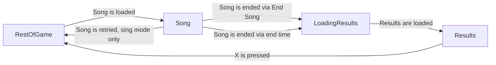

# Singstar

## Game Site

https://retroachievements.org/game/22438

## Overview

Singstar is a 2004 music video game for the PlayStation 2. It was released in PAL regions on May 21st, 2004, but was never released in North America. Sing along to 30 songs that span a variety of genres and time periods using the two bundled Singstar microphones and USB dongle. Build your repetoire and reputation in the Star Maker Mode in singleplayer or compete for leaderboards with one or two players in Sing Mode. There also exists a Party Mode to spice things up where up to 8 players can participate in a round robin style mode, but for these achievements, only one player is necessary.

## Set Design

### Game Flow Description



There are four states of the game that most of the achievements operate under:

#### `Song`
This is when the player is currently performing a song. Specifically:
- The microphone is on (this prevents replays from counting).
- There is only one microphone on (prevents 2 players in Sing mode).
- The player is either specifically in Sing mode or Star Maker mode.
- The game has music audio queued up (there's a very particular value used for this).
- Song progress changed from 0 to 1 this frame (helps differentiate between the cutscenes and actual songs).

The values we care about are:
- The current song ID.
- The player difficulty.
- Whether the song is in normal or short mode.
- The player's current total score.
- The player's current note streak score.

The achievements we care about in this stage are:
- Rick Roll as it triggers as early as we can detect the player is in _Never Gonna Give You Up_.
- Hot Got A Dollar as we want to measure whether the player has reached that certain part of the song.
- Streak achievements as they need to not reset now and begin counting increases to the note streak score.
- Leaderboards as they need to show the player's current total score.

#### `LoadingResults`
This is when the player is transitioning from `Song` to `LoadingResults`. It is important to detect this stage as we don't want to invalidate achievements/leaderboards that operate across stages such as:
- Streak achievements
- Leaderboards

There are no specific values we care about in this stage, as this only lasts a few frames and no achievements should trigger here.

#### `Results`
This is when the player is seeing their score after finishing a song. This is used to trigger most achievements as it awards the player outside of active gameplay (removing distractions), and is simpler to handle playlist-based achievements from the career mode.

This can be detected with:
- `score_screen_detector() == 0x3f4ac000`

The values we care about are:
- The current song ID.
- The player difficulty.
- Whether the current song is in normal or short mode.
- The player's current total score.
- The player's total score across other playlist songs.

The achievements we care about in this stage are:
- Career playlist objectives.
- 9000 score achievement.
- Song easy/hard scores achievements.
- Leaderboard submissions.

#### `RestOfGame`
Every other state doesn't need to be specially considered. We can rest any measures from other achievements/leaderboards and for the most part not trigger anything. It is important to be **not** any of the other three stages when it comes to invalidating achievements though.

The exception are the career buzz rank achievements, which trigger after `Results` when the rank goes up. This can be done simply by detecting that the buzz passed a certain level that frame (but the rank hasn't caught up as that happens later, the player also can't save until afterwards so that handles save protection).

### Achievements

#### Progression

There exists one achievement for each of the 5 Star Maker mode ranks (with the 5th being a win condition). There also exists two for each of the four end of rank events, one for completing it, and another for doing it on hard (which will trigger both in that case). The third and fourth (Harmony Hall and Blue Bay Stadium) are missable as the game continues no matter how poorly you do at those. The other two, the non-hard achievement is marked as Progression, but not the hard ones.

#### Win Condition

Game completion is handled by the 5th rank (Superstar), as the game asks you to do (but doesn't require you to do well in) the Blue Bay Stadium event.

#### Per Song

Each of the game's 30 songs has three achievements:
- Beating the easy score on any difficulty.
- Beating the hard score on the hard difficulty (which is **always** 720 points less).
- Getting a phrase bonus on 75% (rounded up) of the song's phrases.
    - A phrase bonus is acquired when the player gets a cool rated phrase while their star bar is at least 80% full, and the player will get phrase bonus points for doing so.

#### Miscellaneous

There exist a few extra achievements:
- Start _Never Gonna Give You Up_ (just for a joke, 0 points).
- _Perfectly_ sing the rap part in Groove Is In The Heart (just for a joke since there's no notes to sing, 0 points).
- Achieve a score of 9000 on any song on hard (10 points).

### Leaderboards

There are six leaderboards per song, one for combination of difficulty and short/normal length. This equates to 180 leaderboards total.

### Rich Presence

The rich presence when in a song in Sing Mode displays to the following format:

```
Sing Mode: I Believe In A Thing Called Love by The Darkness - Difficulty: Easy, Score: 4000, Time: 2:00/3:47
```

Short version would be:

```
Sing Mode: I Believe In A Thing Called Love (Short) by The Darkness - Difficulty: Easy, Score: 4000, Time: 2:00/3:47
```

When in Star Maker mode:

```
Star Maker Mode: I Believe In A Thing Called Love by The Darkness - Difficulty: Easy, Score: 4000, Time: 2:00/3:47
```

When in Star Maker mode but not in song:
```
Star Maker Mode: Difficulty: Normal, Rating: Wannabe, Buzz: 611, Week: 11
```

In one of the two Star Maker mode cutscenes:
```
In a Star Maker cutscene
```

If in any other menu:

```
Looking through menus
```